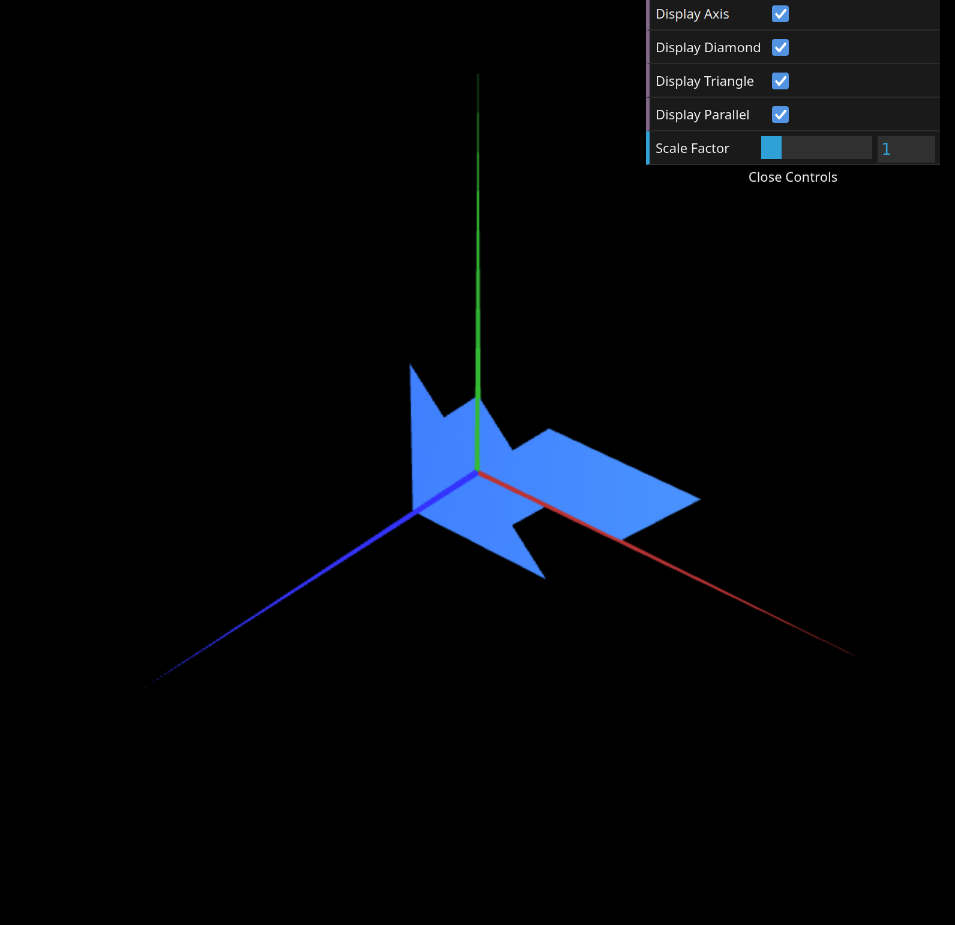
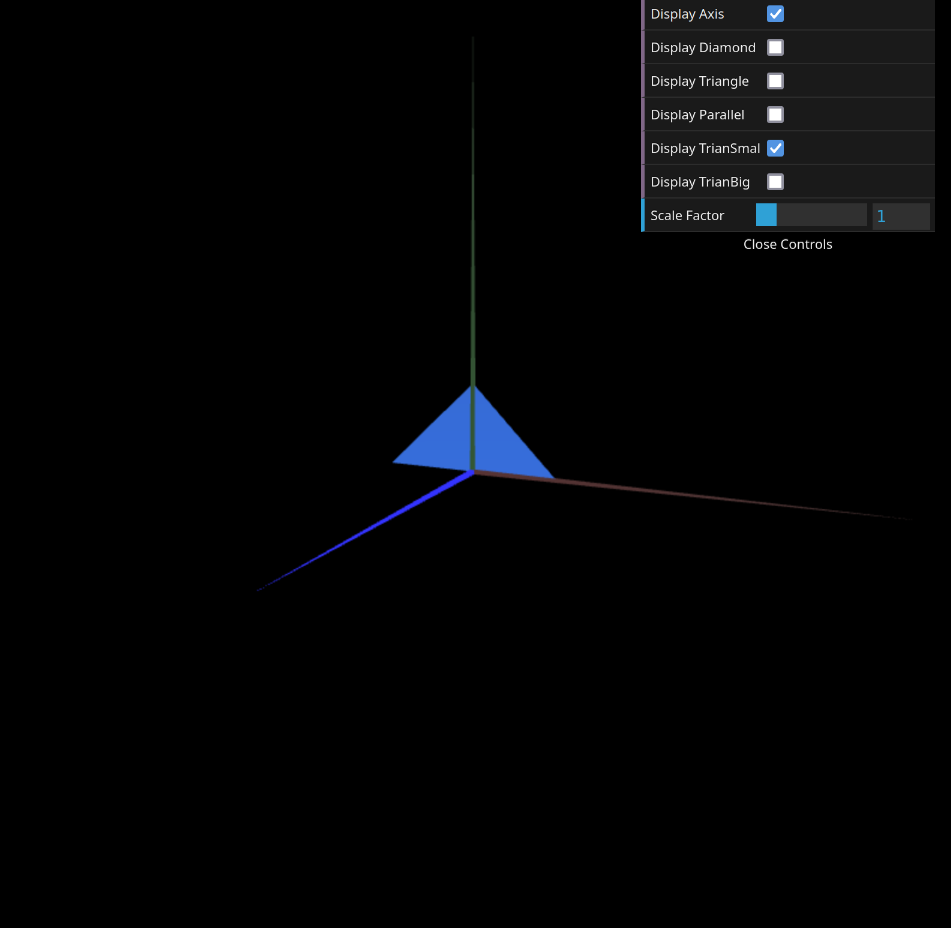
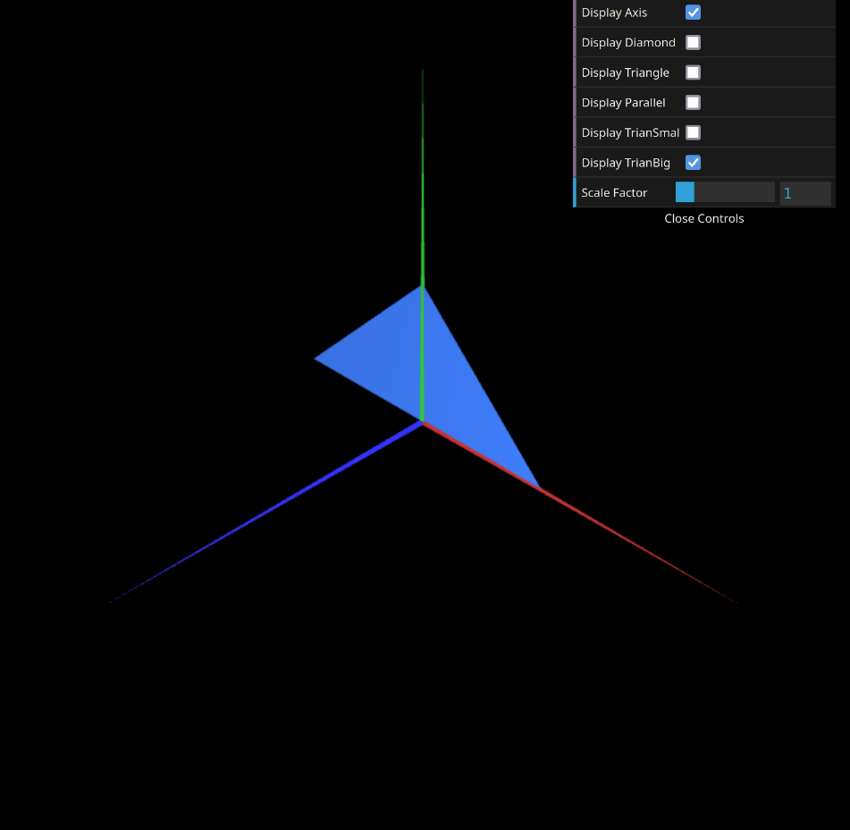

# CG 2023/2024

## Group T0xG0y

## TP 1 Notes

- Project at the beginning stage

- In Exercise 1, we developed new classes for simple images and implemented additional controllers to customize the interface according to user preferences

- Exercise 2 presented a higher level of difficulty, where we created new images.

